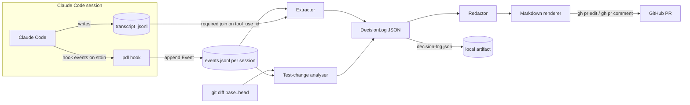

# Design

Design for `pr-decision-log` (CLI name: `pdl`). See [ROADMAP.md](ROADMAP.md) for sequencing and [RESEARCH.md](RESEARCH.md) for the research behind the choices.

> **Revised 2026-09-19 after the Phase 0 spike.** The spike measured 50 real sessions and falsified the original premise: rationale extraction fires on 3% of edits, while the deterministic evidence timeline fires on 100% of sessions. Sections 1, 2, 3, 10 and 11 below are rewritten accordingly. Every claim marked *(measured)* comes from [spike-notes.md](spike-notes.md) and is reproducible with `npm run spike:yield` and `node scripts/spike-evidence.mjs`.

## 1. Principles

1. **Evidence is the product; narrative is a garnish.** Hook events and tool results are facts (what ran, what changed, what failed). Agent text is a claim. The spike settled the ratio between them: rationale cues appear before only 3% of edits (26 of 881, median 0 per session), while commands and edits appear in 50 of 50 sessions and a failing test run in 34 of 50 *(measured)*. So the log must be readable and worth publishing with **zero** narrative in it. A decisions section that renders empty on most PRs is the expected case, not a bug.
2. **Fail open, never block.** A hook bug must never stop the agent or the PR. Every hook path is wrapped; exit code is always 0 unless a config flag explicitly enables gating.
3. **Local by default.** Nothing leaves the machine until `gh pr create` or `pdl publish`, and only the redacted, structured log goes; never the transcript.
4. **Idempotent.** Re-running publish on the same state is a no-op; new commits update the same PR section.
5. **Boring formats.** JSON on disk, Markdown on GitHub, one config file.
6. **Never interpolate into a shell.** The rendered body reaches GitHub through a file on stdin (`gh pr edit --body-file -`), never inside a command string. This is what makes backticks, `$(...)`, quotes and backslashes safe; proven by 8 passing cases in `scripts/spike-splice.mjs` *(measured)*.
7. **Prefer the transcript to the hook payload.** Where both carry a fact, the transcript carries more of it (section 2.1).

## 2. Architecture

Components:

| Component | Runs when | Responsibility | Latency budget |
| --- | --- | --- | --- |
| `pdl hook` (shim) | every configured hook event | Read stdin JSON, normalise to an `Event`, append one line to the **session's** event log. No network, **no git subprocess at all** (see 2.2). | 61 ms measured; `async: true` so it never blocks |
| Event store | always | Append-only JSONL per **session** under `~/.local/share/pdl/<repo-hash>/<session-id>.events.jsonl` (outside the repo, so nothing is ever committed by accident). Branch is resolved at build time, not write time (2.2). Index file maps session -> branch once known. | n/a |
| Extractor | `Stop`, `pdl build` | Join events to the transcript at `transcript_path` (**required**, not optional; see 2.1) and produce a `DecisionLog`. Deterministic rules first; optional model pass behind a flag. | < 2 s |
| Redactor | before render | Strip secrets and raw tool output from anything destined for GitHub. | |
| Renderer | `pdl build`, publish | `DecisionLog` -> Markdown between markers; also writes `decision-log.json`. | |
| Publisher | `PreToolUse Bash(gh pr create*)`, `pdl publish` | Read-modify-write the PR body (or sticky comment) via `gh`. | network |
| Test-change analyser (**Phase 1**, promoted) | `pdl check-tests`, publish | Correlate test-file edits with failing test runs in the timeline and with assertion weakening in the PR diff. Promoted from Phase 2 because the spike showed the timeline signal is present in 19 of 50 sessions and is the one thing no competitor can do. | < 2 s |

### 2.1 The hook payload is not enough (spike finding)

`PostToolUse` delivers the tool's output as an **object**, `tool_result: { "type": "text", "text": "..." }`. The field is `tool_result`, not `tool_response`.

That single rendered blob is less than the transcript holds. The transcript's `toolUseResult` sidecar carries, on 2,528 Bash results *(measured)*:

```json
{ "stdout": "...", "stderr": "...", "interrupted": false, "isImage": false, "noOutputExpected": false }
```

So `stdout` and `stderr` arrive **separately**, and cancellation is explicit. Neither fact is recoverable from the hook payload alone.

**Consequence:** the extractor must join hook events to the transcript by `tool_use_id`. The transcript read moves from optional to required, and the shim's job shrinks to "append the payload and get out of the way". Reliability of outcome detection, best first:

1. `is_error` on the `tool_result` block (present on 220 of 222 sampled Bash results).
2. `interrupted: true` from the sidecar -> outcome `interrupted`, **never** `fail`.
3. Non-empty `stderr` from the sidecar.
4. Per-runner output parsing ("N passed / N failed").

There is **no exit code anywhere in the format**. Every scalar path across 40 large transcripts was searched for `exit`, `returncode` and `status`; the only hits were subagent lifecycle state, a grep-specific `returnCodeInterpretation` string, and `attachment.exitCode`, which is the exit code of a *hook*, not of the agent's command *(measured)*. Any design that assumed `$?` is unavailable.

### 2.2 Branch resolution needs no git subprocess (spike finding)

Every transcript entry already carries `gitBranch`, populated on 14,669 of 14,669 entries sampled *(measured)*, alongside `cwd`, `sessionId`, `uuid`, `parentUuid`, `timestamp`, `version` and `isSidechain`.

The hook payload does **not** carry `gitBranch`. Rather than reintroduce the `git rev-parse` subprocess the original design cached per session, key the event store by `session_id` and resolve the branch at build time from the transcript. This removes a subprocess from the hot path entirely.

Two cases to handle: worktrees report their real branch name, and detached heads report the literal string `HEAD`, which must not be treated as a branch name.

### 2.3 Subagent attribution is free (spike finding)

The parent session id is available three independent ways *(measured)*:

| Route | Detail |
| --- | --- |
| Path | Subagent transcripts live at `<project>/<parent-session-id>/subagents/agent-<agentId>.jsonl` |
| Field | Every entry inside a subagent transcript carries the parent's `sessionId` (222 of 222 in one file) |
| Marker | `isSidechain` is `true` for subagent entries, `false` otherwise (2,637 true / 12,338 false across 40 transcripts) |

The `Task` tool result also carries `{ agentId, status, isAsync, outputFile, resolvedModel, prompt, description }`, so a delegation can be summarised without opening the child transcript at all.

Data flow:



Sequence for the happy path:

1. `SessionStart` -> shim records `{session_id, cwd, transcript_path, model}`. No branch here; it is resolved at build time from the transcript (2.2).
2. `UserPromptSubmit` -> shim records the prompt (truncated, redacted).
3. `PostToolUse Edit|Write` -> shim records `{file, hunks summary}` using `tool_input` (not the file contents).
4. `PreToolUse Bash` (async) -> shim records the command verbatim. **Classification happens at build time, not in the shim** — the shim stays dumb so a pattern-table change does not require re-recording. `PostToolUse`/`PostToolUseFailure Bash` -> records `tool_result` plus `tool_use_id` for the transcript join (2.1).
5. `Stop` -> shim runs the extractor over the branch's events since the last checkpoint, updates `decision-log.json`.
6. `gh pr create` -> **decided in Phase 0: publish post-hoc, not via `updatedInput`.** Let the command run, then a `PostToolUse Bash(gh pr create*)` hook reads the new PR number and splices the section in with `gh pr edit --body-file -`.

   Why not `updatedInput`, despite it being documented and working? The hooks guide states that when several `PreToolUse` hooks return `updatedInput` for the same tool, *the last to finish wins, and because hooks run in parallel the order is non-deterministic*. Any user with another Bash-rewriting hook would silently clobber the log, and the failure would be intermittent and near-impossible to report. The post-hoc path has no such race: it is a read-modify-write against GitHub, guarded by a content hash.

   `updatedInput` stays available behind `publish.mode: "updated_input"` for users who want the body correct on first creation and know they have no competing hook.
7. Later pushes: `pdl publish` (manually, from a git `pre-push` hook, or from a `PostToolUse Bash(git push*)` hook) re-renders and updates the same section.

### 2.4 The splice is proven (spike finding)

`scripts/spike-splice.mjs` covers the read-modify-write with 8 cases, all passing *(measured)*: insertion into an existing body, preservation of the author's own text, a second identical run being a true no-op via a `pdl:hash=` content hash, changed content replacing in place with exactly one marker pair surviving, an empty body, and round-tripping a payload containing backticks, `$(whoami)`, nested double quotes, Windows backslash paths and non-ASCII.

The last case only passes because the body never touches a shell. Write it to a file or pipe it on stdin (`gh pr edit --body-file -`); never build a command string containing it. This is principle 6.

## 3. Decision log schema

`decision-log.json`, schema version `1`. Everything optional except `schema`, `generated_at`, `repo`, `branch`.

```json
{
  "schema": "pdl/1",
  "generated_at": "2026-09-19T10:42:00Z",
  "generator": { "name": "pdl", "version": "0.1.0" },
  "repo": { "remote": "github.com/geraldchang/pr-decision-log", "base": "main", "head_sha": "9f3c2ab" },
  "branch": "feat/retry-sync",
  "sessions": [
    {
      "id": "07186baf-0153-4e2d-af23-b4cfe489b750",
      "agent": "claude-code",
      "agent_version": "2.1.252",
      "model": "claude-opus-5",
      "started_at": "2026-09-19T09:01:12Z",
      "ended_at": "2026-09-19T10:40:03Z",
      "permission_modes": ["plan", "acceptEdits"],
      "prompts": 4,
      "tool_calls": 63
    }
  ],
  "intent": {
    "source": "user_prompt",
    "text": "Add retry with backoff to the nightly sync job; keep the API unchanged."
  },
  "decisions": [
    {
      "id": "d1",
      "title": "Retry at the job level, not in the HTTP client",
      "rationale": "The client is shared with interactive requests where retries would hide latency; the job is the only caller that can tolerate it.",
      "alternatives": ["Add retry middleware to the shared HTTP client"],
      "source": { "kind": "assistant_text", "session": "07186baf", "ref": "req_011CfBnnhv2Q", "at": "2026-09-19T09:14:20Z" },
      "confidence": "stated",
      "files": ["src/jobs/sync.ts"]
    },
    {
      "id": "d2",
      "title": "Use 3 attempts with 2s/4s/8s backoff",
      "rationale": "User confirmed via question.",
      "source": { "kind": "ask_user_question", "session": "07186baf", "ref": "toolu_01ABC" },
      "confidence": "confirmed_by_human"
    }
  ],
  "assumptions": [
    { "text": "Sync job runs once per night, so up to 14s extra latency is acceptable.", "source": { "kind": "assistant_text", "ref": "req_..." } }
  ],
  "verification": [
    { "kind": "test", "command": "npm test -- sync", "outcome": "fail", "at": "2026-09-19T09:30:01Z", "summary": "2 failed" },
    { "kind": "test", "command": "npm test -- sync", "outcome": "pass", "at": "2026-09-19T09:41:55Z", "summary": "12 passed" },
    { "kind": "build", "command": "npm run typecheck", "outcome": "pass", "at": "2026-09-19T09:42:30Z" },
    { "kind": "test", "command": "npm test", "outcome": "interrupted", "at": "2026-09-19T09:44:10Z", "summary": "cancelled by user" }
  ],
  "changes": [
    { "file": "src/jobs/sync.ts", "edits": 4, "lines_added": 31, "lines_removed": 6, "role": "source" },
    { "file": "src/jobs/sync.test.ts", "edits": 2, "lines_added": 18, "lines_removed": 3, "role": "test" }
  ],
  "delegations": [
    { "agent_type": "code-reviewer", "summary": "Flagged missing jitter; not addressed (see open items)." }
  ],
  "open_items": [
    { "text": "No jitter on backoff; fine for a single nightly job, revisit if concurrency grows.", "source": { "kind": "assistant_text", "ref": "req_..." } }
  ],
  "flags": [
    {
      "code": "TEST_EDITED_AFTER_FAILURE",
      "severity": "warn",
      "file": "src/jobs/sync.test.ts",
      "detail": "Edited at 09:35:10 after `npm test -- sync` failed at 09:30:01; assertion count 5 -> 4.",
      "evidence": ["toolu_01FAIL", "toolu_01EDIT"]
    }
  ],
  "redaction": { "rules_applied": ["github_token", "aws_key", "private_key", "env_assignment"], "hits": 1 },
  "rendered_chars": 4210
}
```

Field notes:

- `decisions[].confidence`: `stated` (agent said it), `confirmed_by_human` (via `AskUserQuestion` or a user prompt), `inferred` (extractor heuristic, e.g. an edit reverted within the session), `model_summarised` (only if the optional LLM pass ran). Rendered with different markers so reviewers know what is fact and what is claim.
- `source.kind`: `assistant_text | user_prompt | ask_user_question | plan | subagent | tool_sequence`.
- `verification[].outcome`: `pass | fail | interrupted | unknown`. **No exit code exists in the transcript format** (2.1), so this is always inferred, in this order: `is_error` on the `tool_result` block, then `interrupted` from the sidecar, then non-empty `stderr`, then per-runner output parsing. Never claim `pass` without evidence.
- **`interrupted` is not `fail`.** A run the user cancelled says nothing about the code. Collapsing it into `fail` would corrupt `TEST_EDITED_AFTER_FAILURE`, which is the tool's flagship signal, so the distinction is load-bearing rather than cosmetic.
- `flags[].code` (**Phase 1**, promoted): `TEST_EDITED_AFTER_FAILURE`, `ASSERTIONS_REMOVED`, `TEST_SKIPPED`, `EXPECTATION_LOOSENED`, `TEST_DELETED`, `TEST_ONLY_CHANGE`, `NO_TEST_RUN`.
- `sessions[].id` is the store key (2.2); `branch` is resolved from the transcript's `gitBranch`, with the literal `HEAD` treated as "detached", not as a branch.

## 4. Rendered PR markdown

Wrapped in markers so it can be found and replaced. Keep the log under a configurable budget (default 12,000 chars) out of GitHub's 65,536-character body limit.

```markdown
<!-- pdl:start v=1 sha=9f3c2ab hash=3e1f... -->
## Decision log

*Generated by [pr-decision-log](https://github.com/geraldchang/pr-decision-log) from 1 Claude Code session (claude-opus-5, 63 tool calls, 4 prompts). Facts come from hook events; items marked "stated" are the agent's own words.*

**Intent** (from prompt): Add retry with backoff to the nightly sync job; keep the API unchanged.

### Flags
- **TEST_EDITED_AFTER_FAILURE** `src/jobs/sync.test.ts` edited at 09:35 after the 09:30 test failure; assertion count 5 -> 4. Review this file first.

### Verification (recorded)
| When | Command | Result |
| --- | --- | --- |
| 09:30 | `npm test -- sync` | fail (2 failed) |
| 09:41 | `npm test -- sync` | pass (12 passed) |
| 09:42 | `npm run typecheck` | pass |

### Changes
- `src/jobs/sync.ts` - 4 edits, +31/-6
- `src/jobs/sync.test.ts` - 2 edits, +18/-3 (test)

### Decisions
*Rendered only when the agent actually stated a rationale; absent on most PRs. See section 10.*

1. **Retry at the job level, not in the HTTP client** (stated) - The client is shared with interactive requests where retries would hide latency; the job is the only caller that can tolerate it. Rejected: retry middleware in the shared client. `src/jobs/sync.ts`
2. **3 attempts, 2s/4s/8s backoff** (confirmed by human)

### Assumptions
- Sync job runs once per night, so up to 14s extra latency is acceptable. (stated)

### Open items
- No jitter on backoff; fine for a single nightly job, revisit if concurrency grows.

<details><summary>Delegations and details</summary>

- Subagent `code-reviewer`: flagged missing jitter; not addressed (see open items).
- Sessions: `07186baf` 09:01-10:40 (plan -> acceptEdits).
- Redaction: 4 rules applied, 1 hit.
</details>
<!-- pdl:end -->
```

Section order is deliberate and follows principle 1: **Flags, Verification and Changes come first** because they are facts and are always present; Decisions and Assumptions come last because they are claims and are usually absent.

**Suppress empty sections entirely.** Never render a heading followed by "none recorded" — on most PRs that would be the Decisions section, and a template that advertises a permanently empty slot reads as a broken tool rather than an honest one.

Rendering rules: no raw tool output ever; file paths relative to repo root; commands shown verbatim only if they match the allowlisted runner patterns, otherwise shown as their classified kind; times in the reviewer's timezone are not knowable, so use the session's local time with offset once in the header.

## 5. CLI and hook interface

```
pdl init [--global|--project] [--plugin]   write hook config into settings.json (or print plugin manifest)
pdl hook                                   entrypoint for all hook events; reads stdin, dispatches on hook_event_name
pdl build [--branch B] [--json out.json] [--md out.md]
                                           run extractor + redactor + renderer, no network
pdl publish [--pr N] [--mode body|comment] [--dry-run]
                                           read-modify-write the PR section; exit 0 even on failure unless --strict
pdl show [--branch B]                      print the current log to the terminal
pdl check-tests [--base main]              print test-change flags for the diff + timeline (Phase 1)
pdl redact-check <file>                    run the redactor over any text and print hits (for testing rules)
pdl doctor                                 verify gh auth, hook registration, store permissions, node version
pdl purge [--branch B|--all]               delete local event logs
```

`pdl hook` contract:

- Reads all of stdin, parses JSON, extracts `hook_event_name`. Unknown events are ignored.
- Writes nothing to stdout except on `PreToolUse Bash(gh pr create*)` when `inject.mode = "updatedInput"`, and then only the documented `hookSpecificOutput` JSON.
- Exits 0 always. Errors go to `~/.local/share/pdl/pdl.log`, plus one line on stderr when `PDL_DEBUG=1`.
- Respects `PDL_DISABLE=1` (no-op) for pairing sessions or private work.

Registered as a Claude Code plugin (`hooks/hooks.json`) for one-command install and auto-update, with `pdl init --project` as the fallback that edits `.claude/settings.json`.

## 6. Config file

`pdl.config.json` at the repo root (committed, so teammates share the policy), with `~/.config/pdl/config.json` for personal defaults. JSON, not YAML, to stay dependency-free.

```json
{
  "$schema": "https://raw.githubusercontent.com/geraldchang/pr-decision-log/main/schema/config.v1.json",
  "publish": {
    "mode": "body",
    "max_chars": 12000,
    "on_pr_create": true,
    "on_push": false
  },
  "extract": {
    "decision_markers": ["Decision:", "Chose", "Rejected", "Trade-off", "Assuming"],
    "min_decisions_to_publish": 0,
    "model_summary": false
  },
  "tests": {
    "test_globs": ["**/*.test.*", "**/*.spec.*", "**/__tests__/**", "**/test_*.py", "**/*Tests.swift", "**/*_test.go"],
    "runner_patterns": ["^npm (run )?test", "^pnpm test", "^yarn test", "^npx (vitest|jest)", "^pytest", "^go test", "^swift test", "^xcodebuild .*test", "^dotnet test", "^cargo test"],
    "flag_edit_after_failure": true
  },
  "redaction": {
    "builtin_rules": true,
    "extra_patterns": ["INTERNAL-[A-Z0-9]{8}"],
    "deny_paths": [".env*", "**/secrets/**"],
    "publish_tool_output": false
  },
  "store": { "dir": "~/.local/share/pdl", "retention_days": 30 }
}
```

## 7. Tech stack decision

Options considered:

| | TypeScript on Node | Go single binary | Python | Bash + jq shim |
| --- | --- | --- | --- | --- |
| Hook startup (measured here, Apple M5) | `node -e ""` about 40 ms | typically single-digit ms (not measured; no Go toolchain installed) | `python3 -c "import json,sys"` about 10 ms | `jq`/`bash` under 10 ms |
| Distribution | `npx pdl`, Claude Code plugin, `npm i -g`; later `bun build --compile` for a single binary (cross-targets for macOS/Linux/Windows) | one binary, Homebrew tap; matches Entire CLI | pip/pipx; version drift across machines | copy files; hard to test |
| Ecosystem fit | Claude Code plugins and add-reasoning-to-prs are TS; `gh` does the GitHub part | strong CLI story; you would learn it | good for AST work on Python tests only | none |
| Your toolchain today | Node v26.3.1, npm 11 installed | not installed | 3.14 installed | jq 1.7.1, gh 2.95 installed |
| Portfolio signal | matches your day job (cloud web app); shows CLI + API + testing discipline | shows range | weaker | none |
| Testing | vitest/node:test, fixtures of real hook payloads | go test | pytest | bats |

Decision: **TypeScript on Node, zero runtime dependencies, bundled to one file with esbuild**, published as an npm package and a Claude Code plugin. Reasoning:

1. Latency is fine, now measured end-to-end rather than estimated. The real shim (`src/record.mjs`, reading stdin and appending a line) runs in **61 ms** on this machine *(measured)*, against a 40 ms floor for bare `node -e ""`. All event-recording hooks run `async: true`, so this never blocks the agent; the only synchronous path is publishing, where a second is acceptable. Claude Code runs hooks in parallel, so the shim does not serialise other hooks either.
2. Zero deps keeps install instant and audit trivial (the redactor is security-sensitive; fewer packages to trust). Use `node:fs`, `node:child_process` (for `gh` and `git`), `node:crypto`.
3. It is the language of the surrounding ecosystem and of your job; a reviewer of your portfolio can read it.
4. If startup ever matters (for example a `PreToolUse` on every Bash call in sync mode), the escape hatch is `bun build --compile` for a native-startup binary without a rewrite, or a 20-line bash+jq shim that only appends stdin to the events file and leaves everything else to Node.

Rejected: Go, because it adds a toolchain and a language to learn for a marginal latency gain the async design does not need; Python, because Node is already in the hook ecosystem and Python's packaging story for a hook that must always be on PATH is worse.

Pin Node `>=22` (matches add-reasoning-to-prs's floor and Claude Code's own requirement range; verify current Claude Code minimum in Phase 0).

## 8. Non-goals

- Not a code reviewer, grader or merge gate (flags are advisory; any gating is opt-in via a Check Run in CI).
- Not a transcript archive or replay viewer (Entire, Git AI, claude-replay do this).
- Not a hosted service; no accounts, no telemetry.
- Not per-line authorship attribution.
- Not a general PR description generator from the diff (Copilot, PR-Agent).
- **Not a window into the agent's reasoning.** The spike killed that framing: thinking blocks are empty and rationale precedes 3% of edits *(measured)*. The tool reports what happened, not what the model was thinking. Any README or demo that implies otherwise is overclaiming.
- No Windows support in Phase 1.
- No GitLab/Bitbucket in Phase 1 (publisher is `gh`-only; keep the publisher behind an interface).

## 9. Security and privacy

Threat model: the transcript and hook payloads contain everything the agent saw, including file contents, `.env` values echoed by commands, tokens in URLs, customer data in test fixtures, and internal hostnames. The PR body is often visible to more people than the repo's code (org members, or the public).

Controls:

1. **Structural allowlist, not a blocklist.** The renderer only emits: decision text, assumption text, open items, file paths, classified command kinds (and verbatim commands only if they match `runner_patterns`), pass/fail, counts, timestamps, session ids, model names. Raw tool output (`stdout`, `stderr`, `tool_result.content`, file contents, `old_string`/`new_string`) is **never** rendered. `publish_tool_output` exists only for local `pdl show`.
2. **Redaction pass on the free-text fields** (decisions, assumptions, open items, prompt-derived intent), since agent text can quote a secret. Built-in patterns: GitHub tokens (`ghp_`, `gho_`, `ghu_`, `ghs_`, `ghr_`, `github_pat_`), AWS access keys (`AKIA[0-9A-Z]{16}`) and secret keys, Google API keys (`AIza...`), Slack tokens (`xox[baprs]-`), Stripe (`sk_live_`, `sk_test_`), JWTs (`eyJ...\.eyJ...`), PEM blocks, `KEY=value` lines where KEY contains `SECRET|TOKEN|PASSWORD|PASSWD|API_KEY|PRIVATE`, URLs with `user:pass@`, and high-entropy 32+ char base64/hex runs (entropy threshold configurable, default on). Replace with `[redacted:<rule>]` and count hits in `redaction.hits`.
3. **Path deny-list** (`.env*`, `**/secrets/**`, key files) so even file names of secret-bearing files are omitted from `changes`.
4. **Prompt text is summarised, not quoted**, beyond the first prompt (intent), which is truncated to 300 chars and redacted; prompts often contain pasted logs and credentials.
5. **Dry run by default on first publish** in a repo: `pdl publish` prints the rendered markdown and asks for confirmation the first time (`publish.confirmed_repos` in user config); `--yes` for scripts.
6. **Local store hygiene**: events live under `~/.local/share/pdl` with `0700` permissions, never inside the repo; `retention_days` purge; `pdl purge`. Events store `tool_input` for edits only as `{file_path, added, removed}` counts, not the strings, so the local store itself is low-value if leaked.
7. **Hook safety**: exit 0 always; no `eval`; `gh` and `git` invoked via `execFile` with argument arrays, never a shell string built from payload content (the `gh pr create` command string is parsed, not re-executed).
8. **Opt-out**: `PDL_DISABLE=1`, per-repo `publish.on_pr_create: false`, and honouring Claude Code's `disableAllHooks`.
9. **Public repos**: warn (once) when the remote is public and `publish.mode = "body"`; suggest `comment` mode or reduced sections.
10. **What is still not covered**: a secret written into agent prose that matches no pattern and has low entropy (for example a password like `Summer2026!`). Document this honestly in the README; the structural allowlist is the main defence, the regexes are a second layer.

## 10. Extraction rules (deterministic, v1)

> **Spike result: rule 3 below is near-worthless and must not be the headline.** Across 881 edits in 50 sessions, only 26 were preceded by assistant text containing a rationale cue: 3.0%, median 0 per session, and only 1 of 50 sessions reached 3 hits *(measured)*. The agent narrates what it is about to do, not why it chose it over something else.
>
> The hits that do occur are high-precision. Treat rule 3 as **high precision, near-zero recall**: render it when it fires, never pad it, and never let the PR template imply it should be there.
>
> There is also no hidden reasoning to fall back on: 2,170 of 2,176 `thinking` blocks on disk are stored empty *(measured)*.

Ordered by reliability:

1. `AskUserQuestion` tool_use + the following user answer -> `decision` with `confirmed_by_human`.
2. Plan-mode content (`ExitPlanMode` input, or `permission_mode: plan` turns' final assistant text) -> `decisions`/`assumptions` from bullet lines.
3. Assistant `text` blocks in the same turn (`requestId`) immediately preceding an `Edit|Write|Bash` tool_use, filtered by decision markers (configurable: "because", "instead of", "rather than", "chose", "decided", "trade-off", "assum", "TODO", "left", "not addressed") -> `decisions` or `assumptions` or `open_items` by marker class, `confidence: stated`. **Expect this to yield nothing on most PRs (3% of edits).** Suppress the Decisions heading entirely when empty rather than rendering "none recorded".
4. `last_assistant_message` on `Stop` -> scanned for the same markers; also the source of the "Summary".
5. Tool sequence heuristics -> `verification` (runner pattern + outcome), `changes` (edit counts), `delegations` (SubagentStop summaries), and `inferred` decisions such as "edit to X reverted 4 minutes later".
6. Optional (`extract.model_summary: true`): a `prompt`-type Stop hook or a `pdl build --summarise` call that asks the model to condense items 3-4 into at most five decisions; output labelled `model_summarised`.

**SessionStart elicitation.** Rule 3's yield came in far under one decision per PR, so the fallback the roadmap held in reserve is now the only lever that raises narrative coverage: a `SessionStart` hook whose stdout asks the agent to prefix non-trivial choices with `Decision:`.

Build it, but **default it off**, for two reasons. First, it changes the agent's behaviour to serve the tool, which is a cost borne by every session whether or not a PR results. Second, self-reported descriptions are the least reliable part of an agent PR: in a study of 23,247 agent-authored PRs, descriptions claiming unimplemented changes were the single most common inconsistency (arXiv 2601.04886, see RESEARCH.md). Elicitation makes the tool better at collecting exactly the kind of text that study found untrustworthy.

Gate it on evidence: turn it on for one month, measure whether reviewers act on the elicited decisions, and only then consider changing the default. Until then the tool's value is the evidence timeline, which needs no cooperation from the model at all.

## 11. Test-change analysis (promoted to Phase 1)

**Promoted from Phase 2.** The spike found the timeline signal present in 19 of 50 real sessions *(measured)*, and it is the one capability no competitor can reach: a tool built on prose self-report cannot know that a test file was edited right after that test failed, because that fact exists only in the timeline. This is the differentiator, so it ships in the MVP.

Two independent signals, combined:

**Timeline signal (unique to this tool):** for each test-file edit event, look back for the most recent `verification` with `outcome: fail` whose command matches a runner pattern and whose stdout/stderr (kept locally, never published) mentions the test file or a test name from it. If found within the same session and before any source-file edit that could have fixed it, raise `TEST_EDITED_AFTER_FAILURE` with both tool_use ids as evidence. Also raise `NO_TEST_RUN` if test files changed but no runner command was recorded, and `TEST_ONLY_CHANGE` if only test files changed in a PR whose intent mentions a bug fix.

> **The spike's own count of this signal was wrong, and the fix is the first Phase 1 task.**
>
> `scripts/spike-evidence.mjs` reported 78 occurrences across 19 sessions, but its heuristic **latches**: once any test run fails, every later test-file edit in that session counts, forever. The real number is materially lower and the 78 must not be quoted anywhere.
>
> The correct rule needs three constraints the spike script lacks:
>
> 1. **Window it.** Only edits between a failing run and the next *passing* run of the same command count. The window closes on green.
> 2. **Match the test to the failure.** The failing output must name the file or a test within it; a failure in an unrelated suite is not evidence.
> 3. **Exclude additive edits.** An edit that only adds new test cases is not weakening. Compare assertion counts before and after, not edit presence.
>
> Also exclude `outcome: interrupted` runs from opening a window at all (3, section 2.1). Establishing precision against hand-labelled sessions comes before shipping the flag, not after.

**Diff signal (like assert-diff / Swarm Orchestrator, but cross-language and shallow):** on `git diff base...head` restricted to `test_globs`:

- count removed vs added assertion lines per file using per-language regexes (`expect(`, `assert`, `assert_*`, `XCTAssert*`, `t.Error|t.Fatal|require.|assert.`, `Assert.`), raise `ASSERTIONS_REMOVED` when net negative;
- detect new skip markers (`.skip(`, `xit(`, `xdescribe(`, `it.only(`, `@pytest.mark.skip`, `@unittest.skip`, `t.Skip(`, `XCTSkip`), raise `TEST_SKIPPED`;
- detect removed `it(`/`test(`/`def test_`/`func Test` declarations, raise `TEST_DELETED`;
- detect changed literals inside `toBe|toEqual|assertEqual|XCTAssertEqual` where the source file it exercises also changed (map `foo.test.ts` -> `foo.ts`, `test_foo.py` -> `foo.py`, imports in the test file), raise `EXPECTATION_LOOSENED` at `info` severity (it is often legitimate; the point is to draw the eye).

Language-aware AST checks are out of scope; if precision matters for one language, shell out to assert-diff (Python) or Swarm Orchestrator (TS/JS) and map their findings into `flags`.

Output: `flags[]` in the JSON, a "Flags" section in the markdown, and optionally a `neutral` Check Run from a GitHub Action (`checks: write`) so it is visible in the merge box without blocking.

Because this flag accuses the agent (and by extension the PR author) of a shortcut, a false positive is more costly than a miss. Default every rule to `warn` or `info`, never `error`, and state the evidence inline (`edited at 09:35 after the 09:30 failure; assertion count 5 -> 4`) so a reviewer can dismiss it in seconds.
